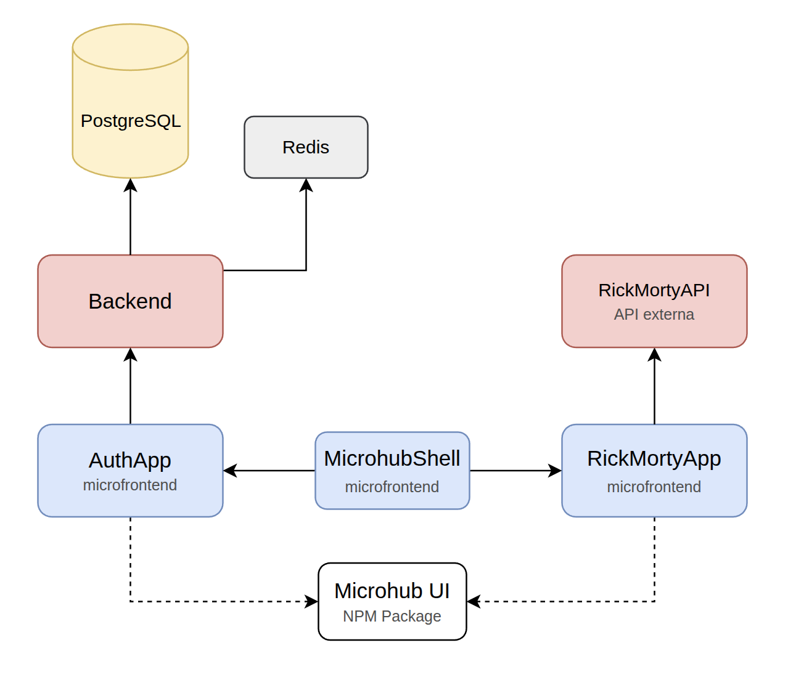
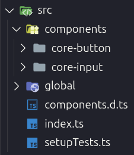
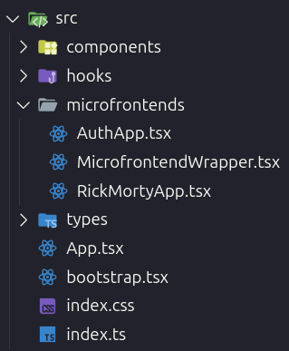
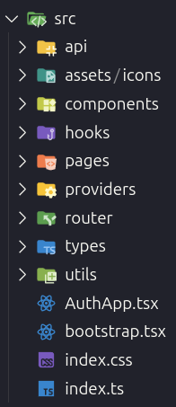
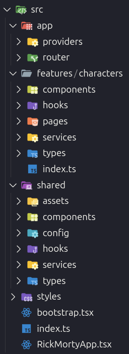

## Arquitetura



### 1 - Arquitetura do Design System `microhub-ui`

Para o design system compartilhado, escolhi o **Stencil** por permitir a criação de Web Components que funcionam nativamente em qualquer framework (React, Vue, Angular) ou vanilla JavaScript. Isso garante que todos os microfrontends possam usar os mesmos componentes, independente da tecnologia escolhida.

#### Padrões Arquiteturais

##### Web Components Nativos

Uso de Web Components para criar componentes isolados, onde cada um tem seus próprios estilos e comportamentos sem interferir nos outros.

##### Multi-Target Build

Configuração para gerar múltiplos formatos de saída:

- **Vanilla Web Components**: Para uso direto no DOM
- **React Wrappers**: Adaptadores automáticos para React
- **ES Modules**: Para bundlers modernos
- **CommonJS**: Para compatibilidade legacy

##### Design Tokens

Sistema de tokens de design usando variáveis CSS para manter consistência visual e facilitar mudanças de tema.

##### Component-Driven Architecture

Cada componente como unidade independente com:

- Props tipadas para configuração
- Eventos customizados para comunicação
- Estilos encapsulados
- Testes unitários isolados

##### Framework Agnostic

Arquitetura que permite uso em qualquer tecnologia frontend sem dependências específicas de framework.

#### Organização de Diretórios

O design system tem uma estrutura simples focada em gerar múltiplos formatos, com separação clara entre código fonte, arquivos compilados e configurações para cada tipo de saída.

```bash
npm-packages/microhub-ui/
├── src/
│   ├── components/       # Web Components (core-button, core-input)
│   ├── global/           # Estilos globais e tokens de design
│   └── index.ts          # Ponto de entrada principal
├── dist/                 # Build para Web Components vanilla
├── react-dist/           # Build para React wrappers
├── loader/               # Lazy loading utilities
└── www/                  # Documentação e playground
```



### 2 - Arquitetura do Microfrontend Principal `microhub-shell`

O `microhub-shell` funciona como a **aplicação principal** que coordena todos os microfrontends. Ele usa o **Webpack Module Federation** para carregar e integrar as outras aplicações dinamicamente, fornecendo navegação unificada e comunicação entre elas.

#### Padrões Arquiteturais

##### Module Federation Host

Aplicação principal que carrega microfrontends remotos dinamicamente conforme necessário.

##### Shared Dependencies Management

Bibliotecas compartilhadas (React, React-DOM, React Router) configuradas para evitar duplicação entre microfrontends.

##### Federated Routing e Shared History API

Sistema de navegação que mantém as rotas sincronizadas entre a aplicação principal e os microfrontends.

##### Cross-Microfrontend Communication

Sistema de eventos customizados para comunicação entre aplicações sem acoplamento direto.

##### Authentication State Orchestration

Gerenciamento centralizado de autenticação compartilhado via eventos e localStorage (não recomendado, será explicado adiante).

#### Organização de Diretórios

O microhub-shell possui uma estrutura enxuta focada na orquestração, com separação clara entre componentes de infraestrutura, wrappers de microfrontends e configurações de federação.

```bash
microfrontends/microhub-shell/
├── src/
│   ├── App.tsx                       # Aplicação principal com roteamento
│   ├── bootstrap.tsx                 # Inicialização da aplicação
│   ├── components/                   # Componentes do microhub-shell
│   ├── hooks/                        # Hooks customizados
│   ├── microfrontends/               # Wrappers para microfrontends remotos
│   │   ├── MicrofrontendWrapper.tsx  # Abstração de montagem
│   │   ├── AuthApp.tsx               # Wrapper para auth microfrontend
│   │   └── RickMortyApp.tsx          # Wrapper para rick-morty microfrontend
│   └── types/                        # Definições TypeScript para módulos remotos
├── config/                           # Configurações Webpack para Module Federation
│   ├── webpack.common.js             # Configuração base
│   ├── webpack.dev.js                # Configuração de desenvolvimento
│   └── webpack.prod.js               # Configuração de produção
└── public/                           # Assets estáticos
```



### 3 - Arquitetura do Microfrontend de autenticação

#### Padrões Arquiteturais

##### Context API + Custom Hooks

Gerenciamento de estado centralizado através do AuthProvider com hook useAuth para acesso simplificado ao contexto de autenticação.

##### Error Boundaries

Tratamento de erros com ErrorBoundary customizado que captura erros React e oferece recuperação automática.

##### Service Layer

Camada de abstração da API que encapsula chamadas HTTP e gerencia persistência local com tratamento de tokens expirados.

##### Hooks Especializados

useApiError para tratamento de erros, useForm para formulários com validação, e useAuth para acesso ao contexto.

##### Proteção de Rotas

ProtectedRoute component para controle de acesso com suporte a roles.

#### Organização de Diretórios

O auth-microfrontend possui uma estrutura básica mas bem organizada, com separação de responsabilidades entre API, estado, componentes e páginas. Os padrões implementados (Context API, hooks customizados, error boundaries) permitem expansão controlada para funcionalidades futuras.

```bash
src/
├── api/           # Camada de comunicação com backend
├── components/    # Componentes reutilizáveis (AuthCard, ProtectedRoute)
├── hooks/         # Hooks customizados para lógica compartilhada
├── pages/         # Páginas da aplicação (Login, Register, Profile)
├── providers/     # Context providers + Error boundaries
├── router/        # Configuração de rotas
├── types/         # Definições TypeScript
└── utils/         # Utilitários (storage, validation)
```



### 4 - Arquitetura do Microfrontend que consome uma API externa

O `rick-morty-microfrontend` foi arquitetado especificamente para demonstrar padrões de consumo de APIs externas em um contexto de microfrontends. A aplicação consome a **Rick and Morty API** implementando padrões modernos de data fetching, cache inteligente, e gerenciamento de estado otimista.

#### Padrões Arquiteturais

##### SWR (Stale-While-Revalidate) Pattern

Cache inteligente que atualiza dados em segundo plano, evita requisições duplicadas e tenta novamente automaticamente em caso de falha.

##### Feature-Based Architecture

Organização por funcionalidades onde cada feature é bem estruturada e organizada, com separação clara entre regras de negócio (dentro de cada feature) e código de infraestrutura (diretório shared).

##### Custom Hooks Pattern

useCharacters para lista com filtros, useCharacterDetail para detalhes individuais, useFavorites e useCharacterLikes para estado persistente.

##### API Client Architecture

Cliente HTTP robusto com interceptadores, classificação de erros e tratamento estratificado para APIs externas.

##### Error Handling Strategy

Sistema de tratamento de erros em várias camadas, classificando erros por tipo e mantendo a aplicação funcionando mesmo quando algo dá errado.

#### Organização de Diretórios

Arquitetura feature-based com separação clara entre funcionalidades de domínio e infraestrutura compartilhada, promovendo escalabilidade e reutilização.

```bash
src/
├── features/          # Funcionalidades de domínio por feature
│   └── characters/    # Feature completa (hooks, pages, services, types)
├── shared/            # Infraestrutura compartilhada
│   ├── components/    # Componentes reutilizáveis
│   ├── hooks/         # Hooks utilitários
│   ├── providers/     # Context providers + Error boundaries
│   ├── services/      # API client + Error logger
│   └── utils/         # Utilitários de apoio
└── router/            # Configuração de rotas
```



### 5 - Arquitetura do Backend

Para o backend, escolhi o **NestJS** por ser amplamente adotado no mercado e oferecer uma arquitetura robusta baseada em decorators e injeção de dependências. O framework abstrai complexidades de configuração enquanto mantém flexibilidade para customizações, permitindo foco na lógica de negócio.

Implementei **TypeORM** como ORM para mapeamento objeto-relacional com **PostgreSQL**, proporcionando type safety e migrations automáticas. Para otimização de performance, integrei **Redis** como camada de cache para dados frequentemente acessados.

#### Padrões Arquiteturais

##### Modularidade

Cada funcionalidade organizada em módulo separado com responsabilidades bem definidas.

##### Padrão MSC (Model-Service-Controller)

Separação clara de responsabilidades por camadas em cada módulo.

##### Dependency Injection

Facilita testes, manutenção e desacoplamento entre componentes.

##### Interceptadores e Guards

- **Global Guards**: Proteção automática de rotas
- **Interceptadores**: Padronização de respostas e transformação de dados

##### Segurança

- Autenticação JWT stateless
- Hashing bcrypt para senhas
- Validação rigorosa com DTOs
- CORS configurado para microfrontends

##### Observabilidade

- Error tracking global
- Health checks
- Documentação automática com Swagger

#### Organização de Diretórios

```bash
backend/src/
├── app.module.ts           # Módulo raiz da aplicação
├── main.ts                 # Ponto de entrada da aplicação
├── auth/                   # Módulo de autenticação
├── users/                  # Módulo de gerenciamento de usuários
├── common/                 # Módulo global com utilitários
├── cache/                  # Módulo de cache (Redis)
├── config/                 # Configurações da aplicação
└── entities/               # Modelos de dados (TypeORM)
```


**Próxima página: [⚙️ Guia Técnico](./TECHNICAL-GUIDE.md)**
