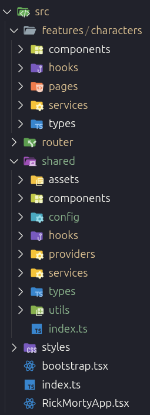
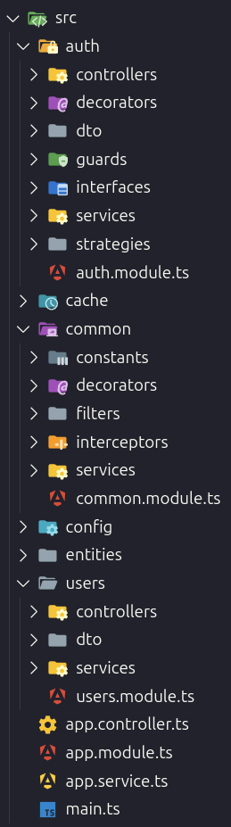

## Arquiteturas dos Microfrontends

### 1 - Arquitetura do Design System `microhub-ui`

Para o design system compartilhado, escolhi o **Stencil** por permitir a criação de Web Components que funcionam nativamente em qualquer framework (React, Vue, Angular) ou vanilla JavaScript. Essa abordagem garante máxima interoperabilidade entre os microfrontends sem acoplamento tecnológico.

#### Padrões Arquiteturais

##### Web Components Nativos

Utilização do padrão Web Components para encapsulamento completo (Shadow DOM, Custom Elements) garantindo isolamento de estilos e comportamentos.

##### Multi-Target Build

Configuração para gerar múltiplos formatos de saída:

- **Vanilla Web Components**: Para uso direto no DOM
- **React Wrappers**: Bindings automáticos para React
- **ES Modules**: Para bundlers modernos
- **CommonJS**: Para compatibilidade legacy

##### Design Tokens

Sistema de tokens de design através de CSS Custom Properties para consistência visual e facilidade de tematização.

##### Component-Driven Architecture

Cada componente como unidade independente com:

- Props tipadas para configuração
- Eventos customizados para comunicação
- Estilos encapsulados
- Testes unitários isolados

##### Framework Agnostic

Arquitetura que permite uso em qualquer tecnologia frontend sem dependências específicas de framework.

#### Organização de Diretórios

O design system possui uma estrutura simples e focada na distribuição multi-target, com separação clara entre código fonte, builds gerados e configurações específicas de cada formato de saída.

```bash
npm-packages/microhub-ui/
├── src/
│   ├── components/        # Web Components (core-button, core-input)
│   ├── global/           # Estilos globais e tokens de design
│   └── index.ts          # Ponto de entrada principal
├── dist/                 # Build para Web Components vanilla
├── react-dist/           # Build para React wrappers
├── loader/               # Lazy loading utilities
└── www/                  # Documentação e playground
```


### 2 - Arquitetura do Microfrontend Principal `microhub-shell`

O `microhub-shell` atua como o **Host Application** na arquitetura de microfrontends, sendo responsável por orquestrar e integrar todos os microfrontends remotos através do **Webpack Module Federation**. Sua função principal é fornecer uma camada de abstração que permite carregamento dinâmico, roteamento unificado e comunicação entre aplicações independentes.

#### Padrões Arquiteturais

##### Module Federation Host

Host que consome microfrontends remotos via ModuleFederationPlugin com carregamento dinâmico e lazy loading.

##### Shared Dependencies Management

Dependências compartilhadas (React, React-DOM, React Router) com configuração singleton para evitar duplicação.

##### Federated Routing e Shared History API

Proxy de navegação que sincroniza roteamento entre shell e microfrontends através de API unificada.

##### Cross-Microfrontend Communication

Sistema de eventos customizados para comunicação entre aplicações sem acoplamento direto.

##### Authentication State Orchestration

Gerenciamento centralizado de autenticação compartilhado via eventos e localStorage (não recomendado, será explicado adiante).

#### Organização de Diretórios

O shell possui uma estrutura enxuta focada na orquestração, com separação clara entre componentes de infraestrutura, wrappers de microfrontends e configurações de federação.

```bash
microfrontends/microhub-shell/
├── src/
│   ├── App.tsx                       # Aplicação principal com roteamento
│   ├── bootstrap.tsx                 # Inicialização da aplicação
│   ├── components/                   # Componentes do shell (Navbar)
│   ├── microfrontends/               # Wrappers para microfrontends remotos
│   │   ├── MicrofrontendWrapper.tsx  # Abstração de montagem
│   │   ├── AuthApp.tsx               # Wrapper para auth microfrontend
│   │   └── RickMortyApp.tsx          # Wrapper para rick-morty microfrontend
│   └── types/                        # Definições TypeScript para módulos remotos
├── config/                           # Configurações Webpack para Module Federation
│   ├── webpack.common.js             # Configuração base
│   ├── webpack.dev.js                # Configuração de desenvolvimento
│   └── webpack.prod.js               # Configuração de produção
└── public/                           # Assets estáticos
```

Esta arquitetura demonstra como um shell pode orquestrar múltiplos microfrontends mantendo baixo acoplamento e alta coesão, permitindo que cada aplicação evolua independentemente enquanto oferece uma experiência unificada ao usuário.


### 3 - Arquitetura do Microfrontend de autenticação

Padrões Arquiteturais Implementados:

##### Context API + Custom Hooks

Gerenciamento de estado centralizado através do AuthProvider com hook useAuth para acesso simplificado ao contexto de autenticação.

##### Error Boundaries

Tratamento de erros com ErrorBoundary customizado que captura erros React e oferece recuperação automática.

##### Service Layer

Camada de abstração da API (authApi) que encapsula chamadas HTTP, implementa retry automático e gerencia persistência local.

##### Hooks Especializados

useApiError para tratamento de erros, useForm para formulários com validação, e useAuth para acesso ao contexto.

##### Proteção de Rotas

ProtectedRoute component para controle de acesso com suporte a roles.

#### Organização de Diretórios

O auth-microfrontend possui uma estrutura básica mas bem organizada, com separação de responsabilidades entre API, estado, componentes e páginas. Embora simples no escopo atual, os padrões implementados (Context API, hooks customizados, error boundaries) permitem expansão controlada para funcionalidades futuras.

```bash
src/
├── api/           # Camada de comunicação com backend
├── components/    # Componentes reutilizáveis (AuthCard, ProtectedRoute)
├── hooks/         # Hooks customizados para lógica compartilhada
├── pages/         # Páginas da aplicação (Login, Register, Profile)
├── providers/     # Context providers + Error boundaries
├── router/        # Configuração de rotas
├── types/         # Definições TypeScript
└── utils/         # Utilitários (storage, validation)
```


### 4 - Arquitetura do Microfrontend que consome uma API externa

O `rick-morty-microfrontend` foi arquitetado especificamente para demonstrar padrões de consumo de APIs externas em um contexto de microfrontends. A aplicação consome a **Rick and Morty API** implementando padrões modernos de data fetching, cache inteligente, e gerenciamento de estado otimista.

#### Padrões Arquiteturais

##### SWR para Data Fetching e Cache Management

Implementação do padrão **stale-while-revalidate** com cache automático, revalidação em background e invalidação inteligente baseada em ações do usuário.

##### Feature-Driven Architecture

Organização por features com estrutura completa (hooks, componentes, páginas, services e tipos) para cada funcionalidade.

##### Custom Hooks Especializados

Hooks customizados para encapsular lógica de data fetching, filtros, paginação e estado local.

##### API Client com Interceptors

Cliente HTTP com interceptors para tratamento uniforme de erros e transformação de respostas.

##### Optimistic Updates

Mutações otimistas via hook `useMutation` para atualizações imediatas na UI.

##### Error Boundaries

ErrorBoundary customizado para captura de erros React e recuperação automática.

#### Organização de Diretórios

A arquitetura implementa um diretório `features` onde cada pasta representa uma seção específica da API consumida. Nesta versão, desenvolvi apenas a funcionalidade de personagens (diretório `characters`), mas a estrutura foi projetada considerando o potencial completo da API do Rick and Morty, que oferece endpoints para localizações e episódios.

```bash
microfrontends/rick-morty-microfrontend/
├── src/
│   ├── RickMortyApp.tsx              # Aplicação principal com providers
│   ├── bootstrap.tsx                 # Inicialização para Module Federation
│   ├── features/                     # Features organizadas por domínio
│   │   └── characters/               # Feature de personagens
│   │       ├── components/           # Componentes específicos da feature
│   │       ├── hooks/                # Hooks customizados (useCharacters, useFilters)
│   │       ├── pages/                # Páginas da feature (List, Detail)
│   │       ├── services/             # API clients específicos
│   │       └── types/                # Tipos TypeScript da feature
│   ├── shared/                       # Código compartilhado entre features
│   │   ├── components/               # Componentes reutilizáveis (Card, Badge, Loading)
│   │   ├── hooks/                    # Hooks utilitários (useMutation, useApiError)
│   │   ├── services/                 # Serviços base (API client, error logger)
│   │   ├── providers/                # Providers globais (SWR, ErrorBoundary)
│   │   ├── config/                   # Configurações (SWR config)
│   │   └── types/                    # Tipos compartilhados
│   ├── router/                       # Configuração de rotas
│   └── styles/                       # Estilos globais
├── config/                           # Configurações Webpack para Module Federation
│   ├── webpack.common.js             # Configuração base
│   ├── webpack.dev.js                # Configuração de desenvolvimento
│   └── webpack.prod.js               # Configuração de produção
└── public/                           # Assets estáticos
```



### 5 - Arquitetura do Backend

Para o backend, escolhi o **NestJS** por ser amplamente adotado no mercado e oferecer uma arquitetura robusta baseada em decorators e injeção de dependências. O framework abstrai complexidades de configuração enquanto mantém flexibilidade para customizações, permitindo foco na lógica de negócio.

Implementei **TypeORM** como ORM para mapeamento objeto-relacional com **PostgreSQL**, proporcionando type safety e migrations automáticas. Para otimização de performance, integrei **Redis** como camada de cache para dados frequentemente acessados.

#### Padrões Arquiteturais

##### Modularidade

Cada funcionalidade organizada em módulo separado com responsabilidades bem definidas.

##### Padrão MSC (Model-Service-Controller)

Separação clara de responsabilidades por camadas em cada módulo.

##### Dependency Injection

Facilita testes, manutenção e desacoplamento entre componentes.

##### Interceptadores e Guards

- **Global Guards**: Proteção automática de rotas
- **Interceptadores**: Padronização de respostas e transformação de dados

##### Segurança

- Autenticação JWT stateless
- Hashing bcrypt para senhas
- Validação rigorosa com DTOs
- CORS configurado para microfrontends

##### Observabilidade

- Error tracking global
- Health checks
- Documentação automática com Swagger

#### Organização de Diretórios

```bash
backend/src/
├── app.module.ts           # Módulo raiz da aplicação
├── main.ts                 # Ponto de entrada da aplicação
├── auth/                   # Módulo de autenticação
├── users/                  # Módulo de gerenciamento de usuários
├── common/                 # Módulo global com utilitários
├── cache/                  # Módulo de cache (Redis)
├── config/                 # Configurações da aplicação
└── entities/               # Modelos de dados (TypeORM)
```


