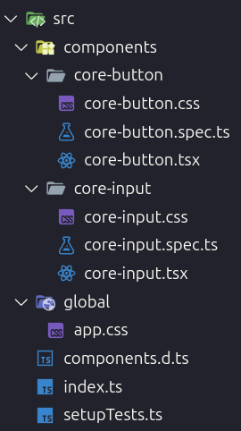

## Arquiteturas dos Microfrontends

### 1 - Arquitetura do Design System `microhub-ui`

Para o design system compartilhado, escolhi o **Stencil** por permitir a criação de Web Components que funcionam nativamente em qualquer framework (React, Vue, Angular) ou vanilla JavaScript. Essa abordagem garante máxima interoperabilidade entre os microfrontends sem acoplamento tecnológico.

#### Padrões Arquiteturais

##### Web Components Nativos

Utilização do padrão Web Components para encapsulamento completo (Shadow DOM, Custom Elements) garantindo isolamento de estilos e comportamentos.

##### Multi-Target Build

Configuração para gerar múltiplos formatos de saída:

- **Vanilla Web Components**: Para uso direto no DOM
- **React Wrappers**: Bindings automáticos para React
- **ES Modules**: Para bundlers modernos
- **CommonJS**: Para compatibilidade legacy

##### Design Tokens

Sistema de tokens de design através de CSS Custom Properties para consistência visual e facilidade de tematização.

##### Component-Driven Architecture

Cada componente como unidade independente com:

- Props tipadas para configuração
- Eventos customizados para comunicação
- Estilos encapsulados
- Testes unitários isolados

##### Framework Agnostic

Arquitetura que permite uso em qualquer tecnologia frontend sem dependências específicas de framework.

#### Organização de Diretórios

O design system possui uma estrutura simples e focada na distribuição multi-target, com separação clara entre código fonte, builds gerados e configurações específicas de cada formato de saída.

```bash
npm-packages/microhub-ui/
├── src/
│   ├── components/        # Web Components (core-button, core-input)
│   ├── global/           # Estilos globais e tokens de design
│   └── index.ts          # Ponto de entrada principal
├── dist/                 # Build para Web Components vanilla
├── react-dist/           # Build para React wrappers
├── loader/               # Lazy loading utilities
└── www/                  # Documentação e playground
```



### 3.2 - Arquitetura do Microfrontend Principal `microhub-shell`

...

### 3.3 - Arquitetura do Microfrontend que consome uma API externa

A arquitetura do microfrontend que consome uma API externa `rick-morty-microfrontend` foi pensada exclusivamente no consumo dessa API.

...

#### Organização de Diretórios

Implementei um diretório `features` onde cada pasta representa uma seção específica da API consumida. Nesta versão, desenvolvi apenas a funcionalidade de personagens (diretório `characters`), mas a arquitetura foi projetada considerando o potencial completo da API do Rick and Morty, que oferece endpoints para localizações e episódios. Essas funcionalidades futuras seriam organizadas como novos diretórios dentro de `features`, mantendo a modularidade e escalabilidade da aplicação.


### 3.4 - Arquitetura do Microfrontend de autenticação

Padrões Arquiteturais Implementados:

##### Context API + Custom Hooks

Gerenciamento de estado centralizado através do AuthProvider com hook useAuth para acesso simplificado ao contexto de autenticação.

##### Error Boundaries

Tratamento de erros com ErrorBoundary customizado que captura erros React e oferece recuperação automática.

##### Service Layer

Camada de abstração da API (authApi) que encapsula chamadas HTTP, implementa retry automático e gerencia persistência local.

##### Hooks Especializados

useApiError para tratamento de erros, useForm para formulários com validação, e useAuth para acesso ao contexto.

##### Proteção de Rotas

ProtectedRoute component para controle de acesso com suporte a roles.

##### Persistência Local

Utilitário storage que gerencia localStorage com validação de expiração de tokens JWT.

#### Organização de Diretórios

O auth-microfrontend possui uma estrutura básica mas bem organizada, com separação de responsabilidades entre API, estado, componentes e páginas. Embora simples no escopo atual, os padrões implementados (Context API, hooks customizados, error boundaries) permitem expansão controlada para funcionalidades futuras.

```bash
src/
├── api/           # Camada de comunicação com backend
├── components/    # Componentes reutilizáveis (AuthCard, ProtectedRoute)
├── hooks/         # Hooks customizados para lógica compartilhada
├── pages/         # Páginas da aplicação (Login, Register, Profile)
├── providers/     # Context providers + Error boundaries
├── router/        # Configuração de rotas
├── types/         # Definições TypeScript
└── utils/         # Utilitários (storage, validation)
```


### 3.5 - Arquitetura do Backend

Para o backend, escolhi o **NestJS** por ser amplamente adotado no mercado e oferecer uma arquitetura robusta baseada em decorators e injeção de dependências. O framework abstrai complexidades de configuração enquanto mantém flexibilidade para customizações, permitindo foco na lógica de negócio.

Implementei **TypeORM** como ORM para mapeamento objeto-relacional com **PostgreSQL**, proporcionando type safety e migrations automáticas. Para otimização de performance, integrei **Redis** como camada de cache para dados frequentemente acessados.

#### Padrões Arquiteturais

##### Modularidade

Cada funcionalidade organizada em módulo separado com responsabilidades bem definidas.

##### Padrão MSC (Model-Service-Controller)

Separação clara de responsabilidades por camadas em cada módulo.

##### Dependency Injection

Facilita testes, manutenção e desacoplamento entre componentes.

##### Interceptadores e Guards

- **Global Guards**: Proteção automática de rotas
- **Interceptadores**: Padronização de respostas e transformação de dados

##### Segurança

- Autenticação JWT stateless
- Hashing bcrypt para senhas
- Validação rigorosa com DTOs
- CORS configurado para microfrontends

##### Observabilidade

- Error tracking global
- Health checks
- Documentação automática com Swagger

#### Organização de Diretórios

```bash
backend/src/
├── app.module.ts           # Módulo raiz da aplicação
├── main.ts                 # Ponto de entrada da aplicação
├── auth/                   # Módulo de autenticação
├── users/                  # Módulo de gerenciamento de usuários
├── common/                 # Módulo global com utilitários
├── cache/                  # Módulo de cache (Redis)
├── config/                 # Configurações da aplicação
└── entities/               # Modelos de dados (TypeORM)
```


