# Guia Técnico

Nessa seção, vou explicar como funciona o projeto.

## Backend

Como o Backend foi realizado com NestJS, a documentação técnica ficará muito voltada ao funcionamento do mesmo, visto que é um framework que abstrai muito a complexidade de se trabalhar com APIs.

### Cache com Redis

Implementei um sistema de cache bem simples com Redis para a busca de usuário

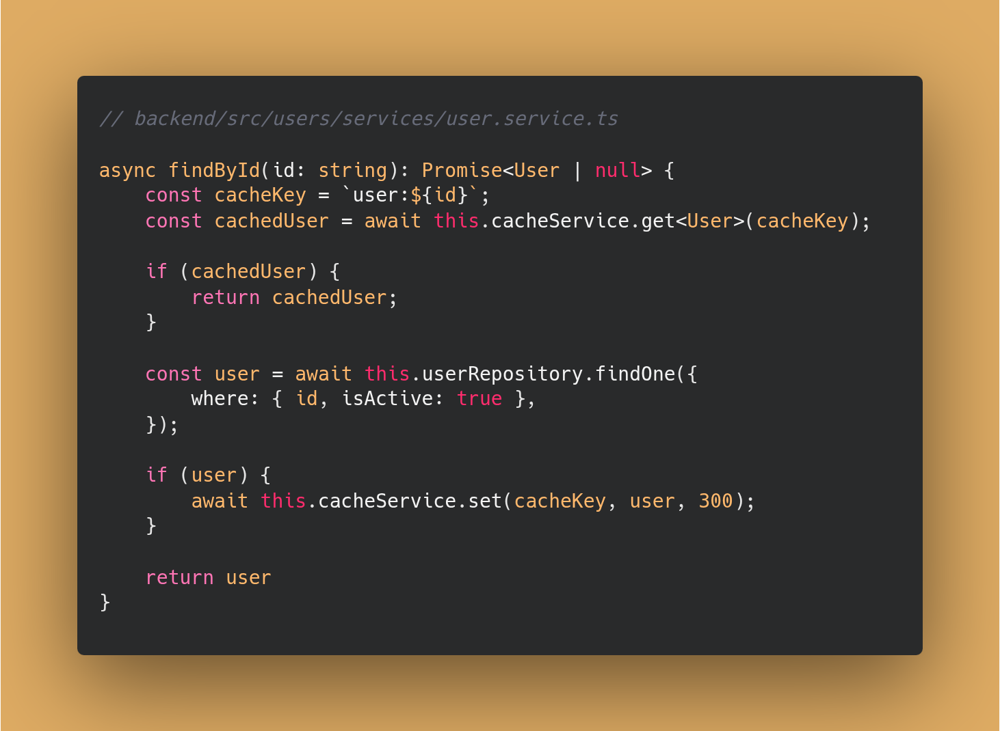
Exemplo com findById.

Verifica o cache primeiro. Se não está no cache, busca no banco. Se achou, adiciona no cache.

As outras requisições são tratadas de forma parecida. O prazo de cache é de 5 minutos.

### Autenticação com JWT

No Nest, os guards são classes que implementam a função `canActivate`. Eles são responsáveis por verificar se o usuário tem permissão para acessar uma rota.

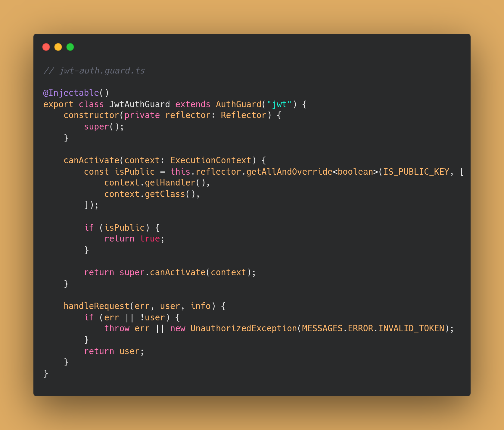

## Microfrontends

### Tratamento de erros

O Error Boundary foi implementado com o uso do pacote 'react-error-boundary'. A ideia foi criar um componente que seja capaz de ser utilizado em qualquer contexto.

Acredito que o ideal seria ele estar em uma lib própria de utilitários de frontend (NPM Package) para ser reutilizado em outros projetos junto com outros utilitários.
No caso desse projeto, o código do Error Boundary é o mesmo no projeto `auth-microfrontend` e `rick-morty-microfrontend`.

Exemplo de uso básico:

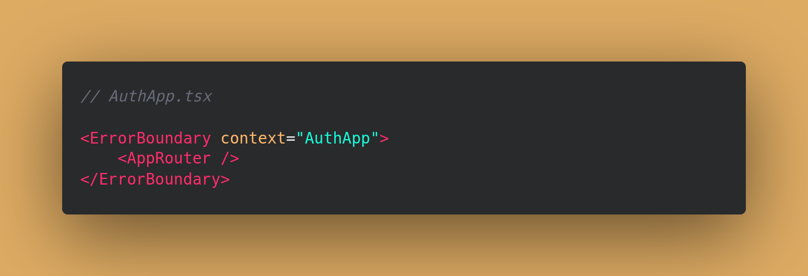

É possível customizá-lo completamente. Segue um exemplo de como isso pode ser feito:

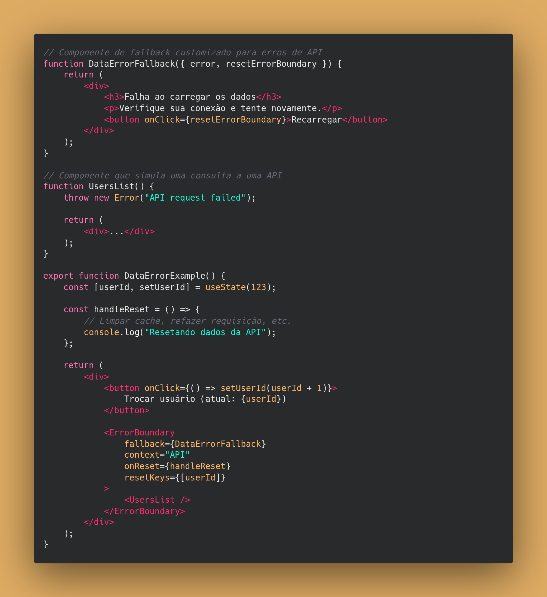

O resetKeys é uma propriedade do react-error-boundary que recebe um array de valores que, quando algum deles é alterado, reseta o erro.

A implementação do ErrorBoundary é bem simples e direta, segue o código real algumas explicações:

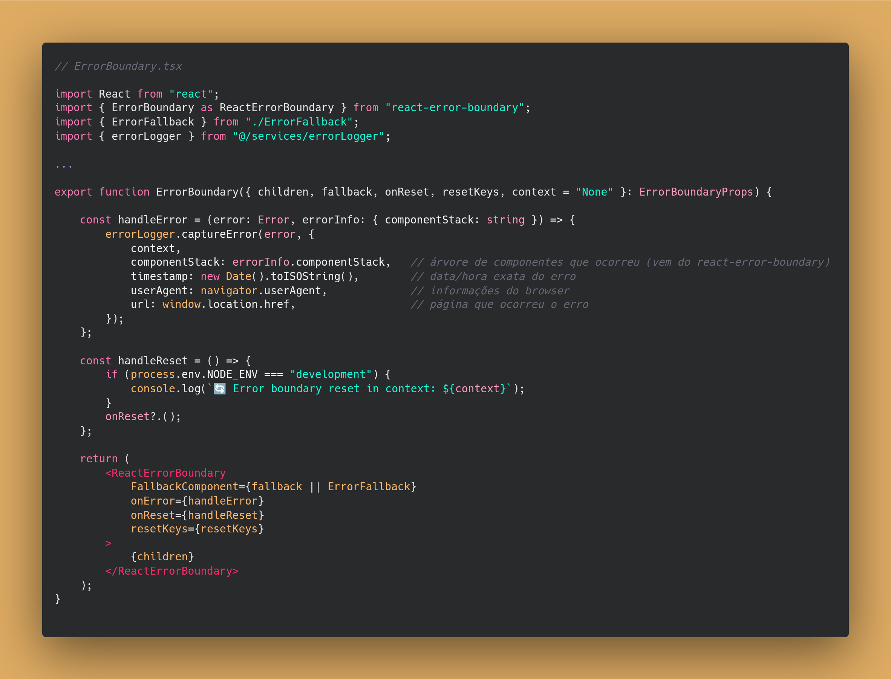

O errorLogger é um objeto que é responsável por capturar os erros e enviar para o console (em desenvolvimento) e, em produção, para algum outro serviço de monitoramento (como Sentry, LogRocket, etc). Não cheguei a implementar essa integração, mas a forma de integrar isso é bem simples:

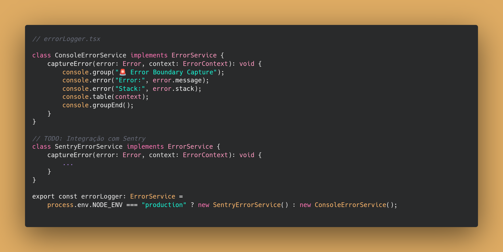

O ErrorBoundary também recebe um fallbackComponent por padrão, que é um componente que criei que segue uma estrutura parecida com o do DataErrorFallback da penúltima imagem.

A visualização do ErrorFallback padrão desse projeto é a seguinte:

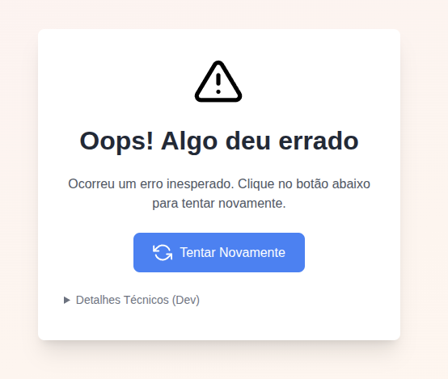

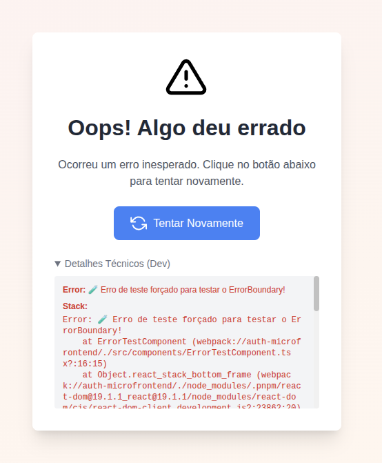

Os detalhes técnicos aparecem somente para desenvolvedores e mostram o erro e o stack trace para debug.

Mas, apenas envolver o componente principal com ErrorBoundary não é suficiente para capturar erros assíncronos.
Por isso, foi necessário criar um hook para capturar os erros assíncronos. Segue o código com um exemplo de uso:

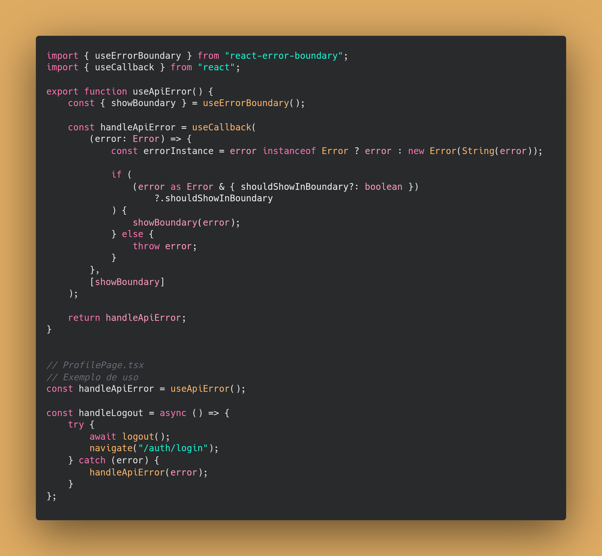

Como pode ser visto, o`react-error-boundary` já possui um hook para invocar o ErrorBoundary. Então a implementação é bem simples.

Essa propriedade `shouldShowInBoundary` é uma propriedade que é acoplada ao error (como um decorator) no interceptor do axios (que é usado para as requisições). Nele, defini que erros com status >= 500, o erro é mostrado via ErrorBoundary. Pois como são erros do servidor, o usuário não pode fazer nada para resolver. Os demais, são tratados inline.

Caso seja um formulário, o hook criado `useForm` chama o `handleApiError` internamente para capturar os erros caso passe pelas verificações de validação definidas.

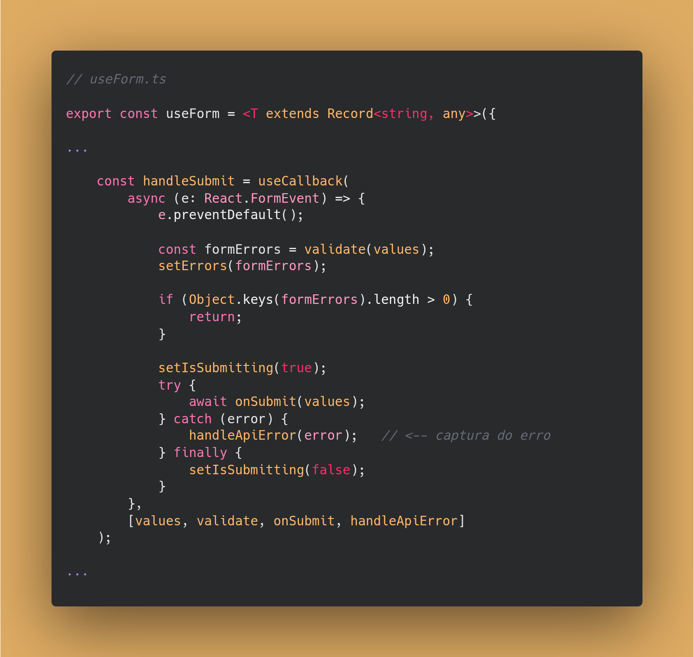

Dessa forma, os erros são lidados de forma consistente em qualquer contexto.

### Formuláros

Para envio de formulários, eu considerei utilizar o Formik ou outro framework bem estabelecido, mas, como comentado acima, optei por implementar um hook `useForm` para evitar tantas dependências.

Nele, é possível passar uma função de validação e uma função de submit.

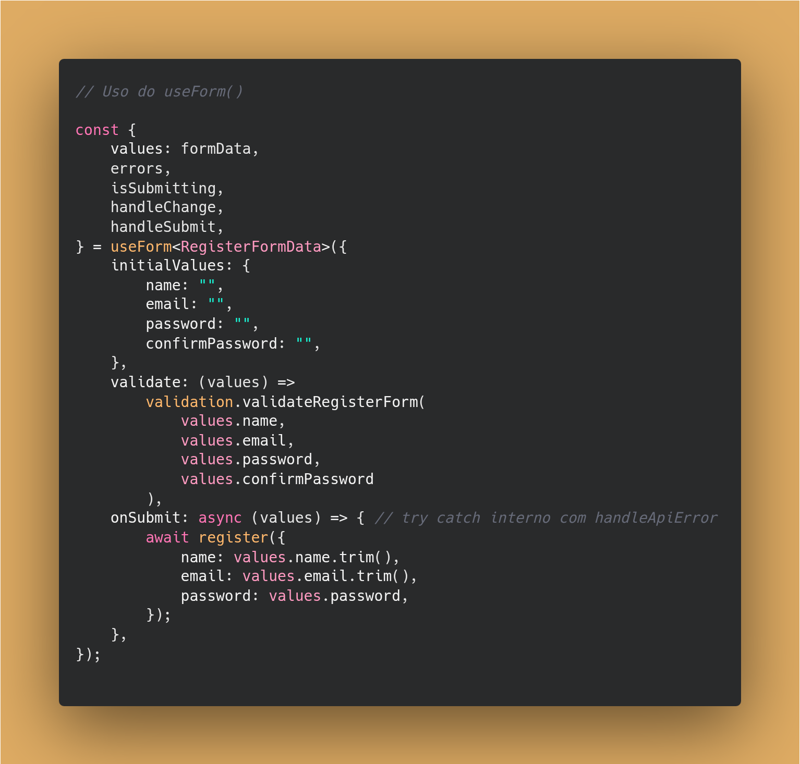

As funções de validação são simples e estão armazenadas no arquivo `validation.ts`.

### AuthApp e conexão com o backend

Para armazenar o token e o usuário, foi utilizado o localstorage.

O motivo do uso de localstorage foi explicado [aqui](./TROUBLESHOOTING.md#11---compartilhamento-de-estadosautenticação-entre-microfrontends).

Como não é a solução ideal e deve ser substituída, não irei elaborar sobre ela neste documento.

No `AuthApp`, a conexão com o backend é feita diretamente via Axios. Para aprimorar essa comunicação, poderia ser implementado um sistema de retry com exponential backoff (estratégia em que o tempo de espera entre cada tentativa aumenta de forma exponencial) e jitter (variação aleatória nesse tempo de espera para evitar sobrecarga simultânea).
Outra alternativa seria utilizar o `SWR`, que já oferece essas soluções nativamente e ainda possibilita adicionar cache no client side, o que não foi implementado neste App pois não faria tanto sentido por ser um microfrontend de autenticação.

Já no `RickMortyApp`, a conexão com o backend é feita através do `SWR`, que já oferece essas soluções nativamente e ainda possibilita adicionar cache no client side.

### Rota Protegida

Rotas que necessitam de autenticação são encapsuladas em um componente `ProtectedRoute` que verifica se o usuário está autenticado e redireciona para a página de login se não estiver.

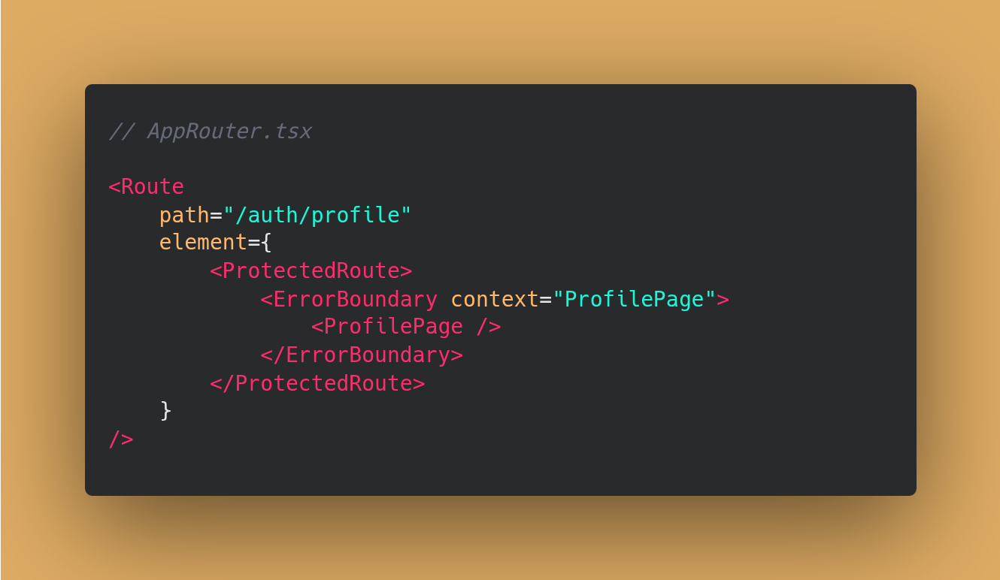

Além disso, esse ProtectedRoute é capaz também de receber um parâmetro para identficar se o usuário possui determinado cargo (no backend, existe um campo `role` com possibilidade de ser `admin`, apesar de eu não ter utilizado isso no frontend).

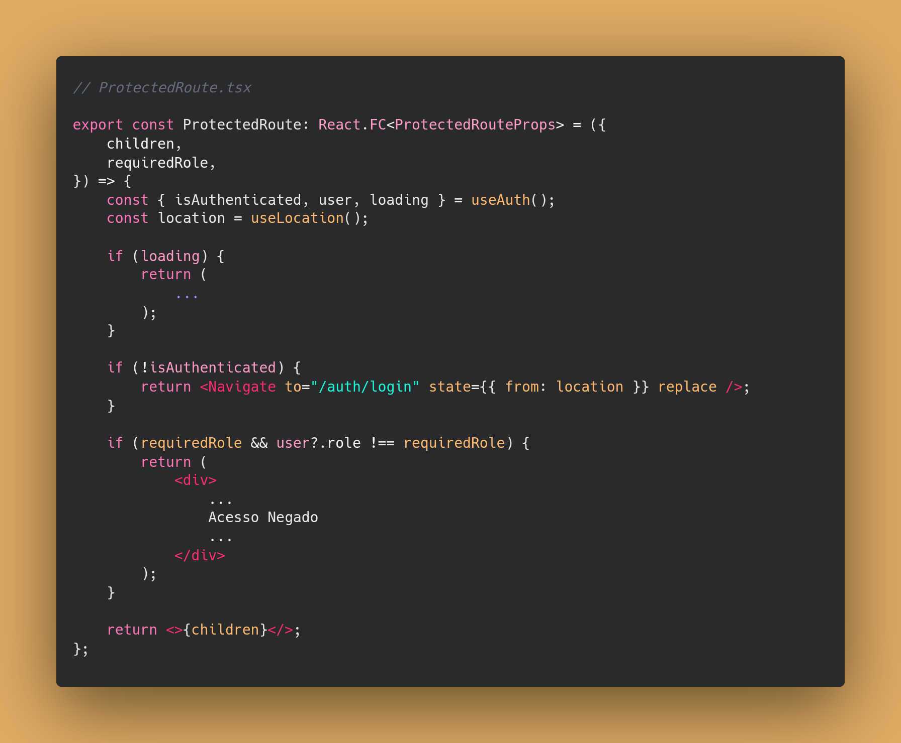

### Interceptação de requisições

### Microfrontend de Autenticação

### Importação em lote e Aliases de Caminho (Barrel Export e Path Aliases)

Em todos os projetos, a técnica do Path Alias foi utilizada para importar arquivos de forma mais fácil e organizada.
Que é a importação dos arquivos através de `@/` em vez de `../`, `../../`.

E a estratégia do Barrel Export para auxiliar nessa importação.
Que é a criação de arquivos `index.ts` em cada pasta que exportam todos os arquivos da pasta.

### Exportação de assets

A fim de facilitar a importação de assets, foi criado um arquivo `index.ts` em cada pasta de assets que exporta todos os assets da pasta.

```bash
assets/
├── icons/
│   ├── alert.tsx
│   ├── person.tsx
│   ├── index.tsx
│   ...
```

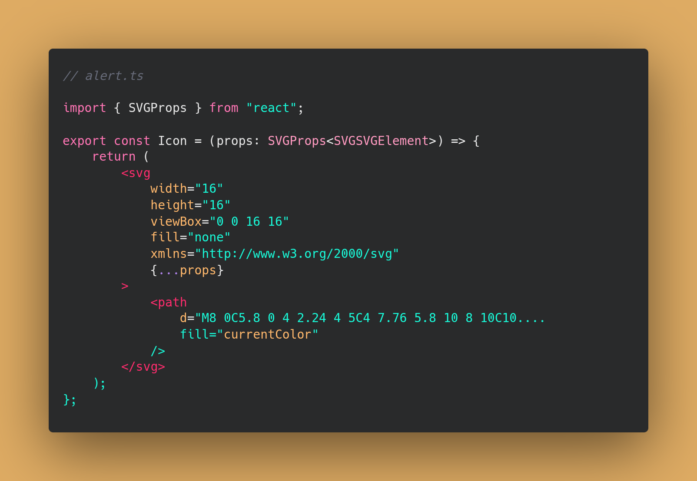

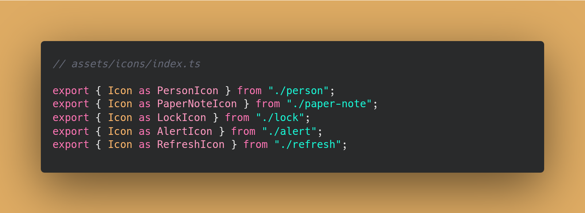

Foi realizado dessa forma para que seja possível importar os Assets como React Components e alterar sua estilização de forma mais fácil. Além disso, todos com o nome `Icon` facilita em manutenção, escalabilidade e evitar conflitos de nomes dos ícones.

Exemplo de uso dos ícones:

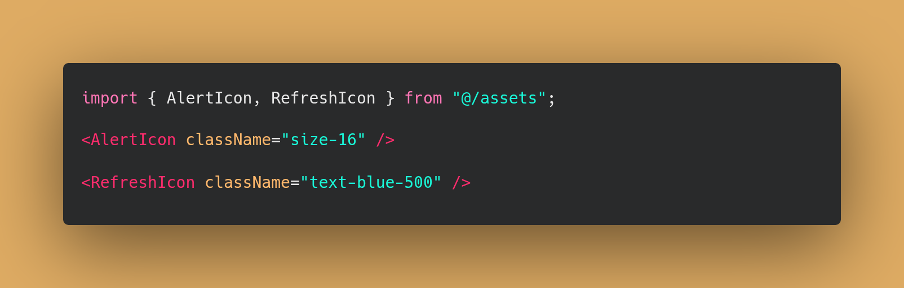

### Criação do env.d.ts

Criei arquivo env.d.ts em todos os microfrontends para evitar baixar o @types/node apenas para o process.env (que foi necessário para o arquivo `bootstrap.ts`).
O @types/node é um pacote relativamente pesado que aumentaria o bundle. E também traria tipagens inconsistentes com o que de fato funciona no browser.

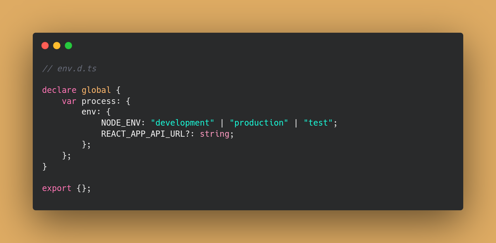

## NPM Package

Para facilitar a visualização dos componentes, descobri algo chamado [Storybook](https://storybook.js.org/). Mas achei que precisaria de mais tempo para estudar pois nunca utilizei, então resolvi não utilizar e fiz uma documentação mais básica.

### Componentes do Design System

A implementação foi feita seguindo o padrão do Stencil para a criação de Web Components. Tentei fazer o mais simples possível e que fosse funcional. Claro que, em um projeto real, há muito o que melhorar e esses arquivos ficariam bem mais complexos.

A seguir, ilustrando o código do botão (implementação, testes e CSS) para exemplificar a implementação de um componente do Design System:

```bash
core-button/
├── core-button.tsx
├── core-button.css
└── core-button.spec.ts
```

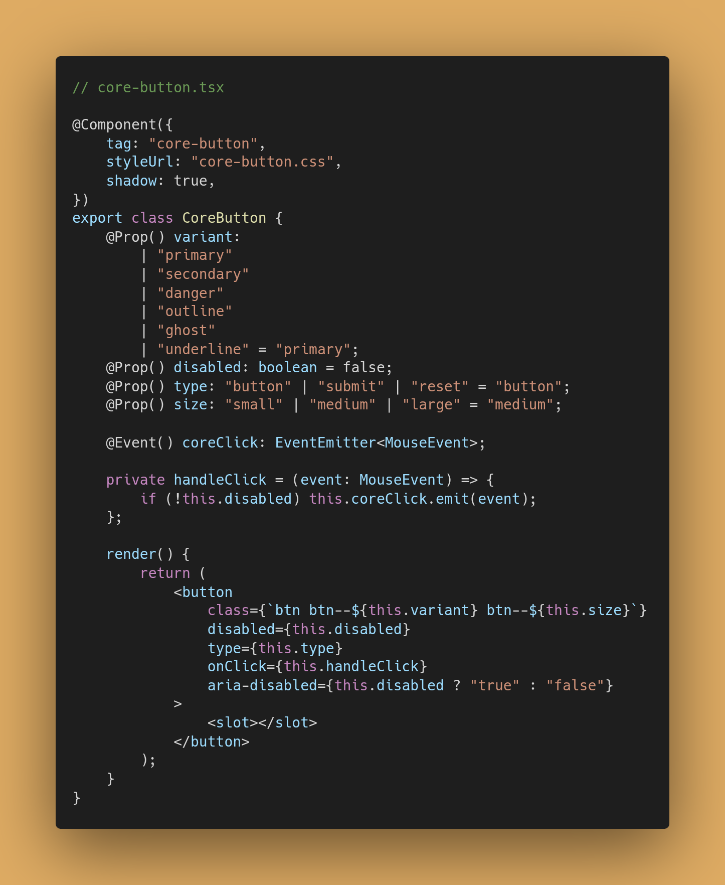


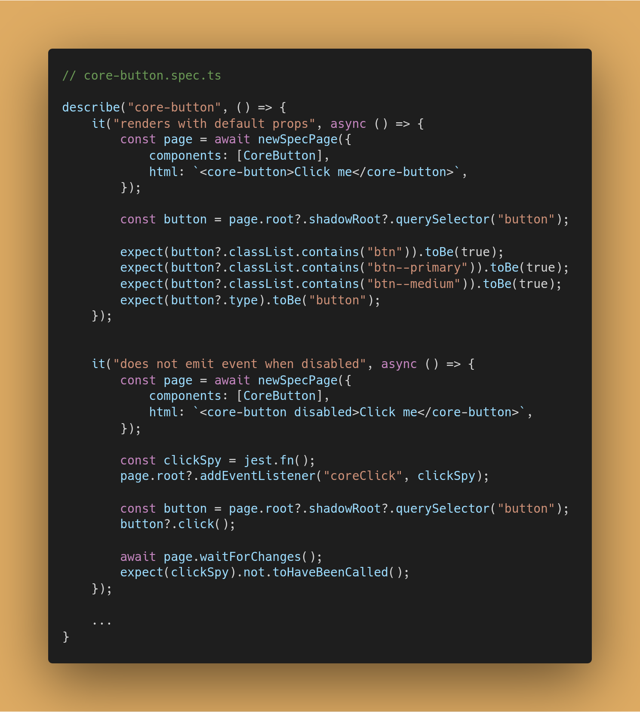

### Export com Stencil para React

Utilizei o `@stencil/react-output-target` para transformar os Web Components produzidos pelo Stencil em Componentes React. O motivo está [aqui](./TROUBLESHOOTING.md#21---problema-de-compartilhamento-npm-package--stencil-com-microfrontends).

> O Stencil também possui bibliotecas oficiais para exportar no formato específico de cada framework (Angular, Vue, etc).

Ele armazena os Componentes React em formato TypeScript numa pasta `react/` na raiz do projeto.

Como o Webpack não conseguiu processar diretamente o código TypeScript, decidi compilá-lo para JavaScript e separar os arquivos de tipagem. Assim, os microfrontends importam o Javascript sem precisar de uma configuração no webpack especial (sem precisar transpilar TS de node_modules).

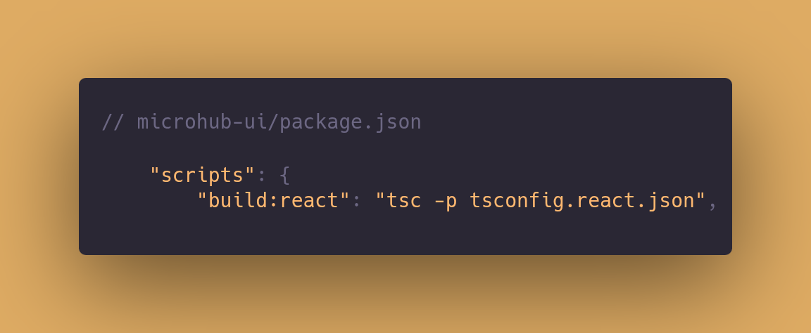

A vantagem é que os microfrontends importam o Javascript sem precisar de uma configuração no webpack especial (sem precisar transpilar TS de node_modules). Ou seja, simplifica o lado dos microfrontends.

Em resumo:

```bash
microhub-ui/
├── react/
│   ├── components.ts
│   └── index.ts
├── react-dist/
│   ├── components.d.ts
│   ├── components.js
│   ├── index.d.ts
│   └── index.js
├── ...
```

`react/`

- Código fonte dos proxies;
- Gerado automaticamente pelo Stencil;
- Contém import type, JSX, etc.

`react-dist/`

- Código compilado dos proxies;
- Pronto para consumo direto;
- JS + .d.ts separados.

Ou seja, nos microserviços de React funcionará como um React Component <CoreButton />, mas por baixo é um Web Component universal <core-button>, que funcionará em Vue, Angular, etc. É como um Adapter Pattern entre Web Components e React.

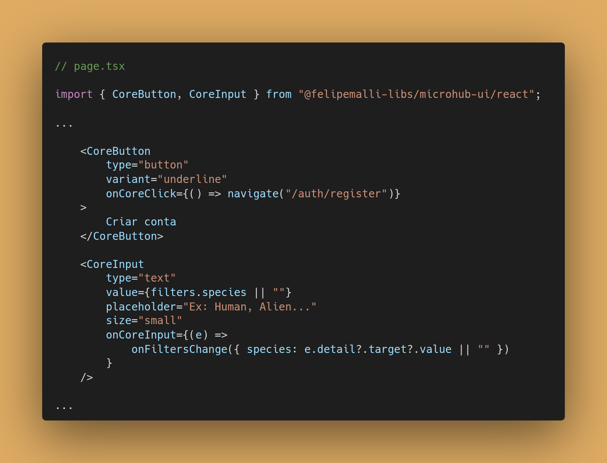
Uso dos componentes do NPM Package `microhub-ui`.

### Tipografia

Para utilizar os Web Components, é necessário importar o CSS do Stencil, a segunda linha da imagem abaixo.

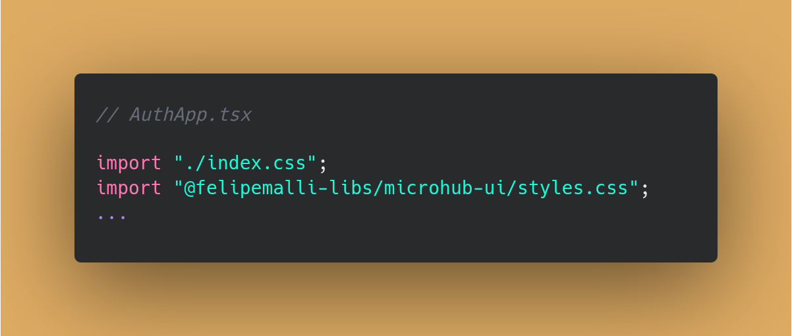

Eu não estava satisfeito com precisar definir para qualquer tag HTML a fonte, cor e o tamanho da fonte e ainda me preocupar em padronizar entre todos os microfrontends. Então, resolvi definir no CSS da lib que eu já havia criado.

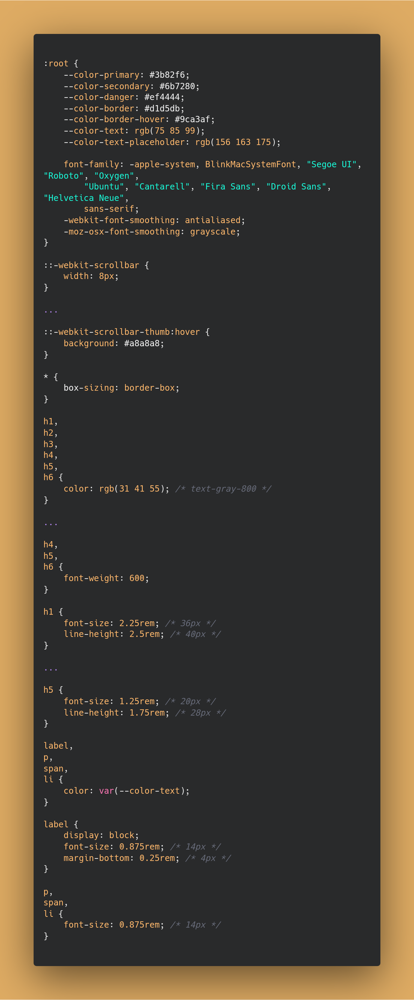

Importante ressaltar que essas estilizações vindas do NPM Package podem e devem ser sobrescritas de acordo com as situações, elas são apenas um ponto de partida para a padronização do sistema.

Veja um exemplo de uso em que já há estilizações padrão, mas algumas classes foram sobrescritas (como cor e tamanho no parágrafo):


Em um cenário real, eu provavelmente implementaria uma forma de importar apenas partes específicas da UI do NPM Package, mas para esse projeto foi suficiente.
