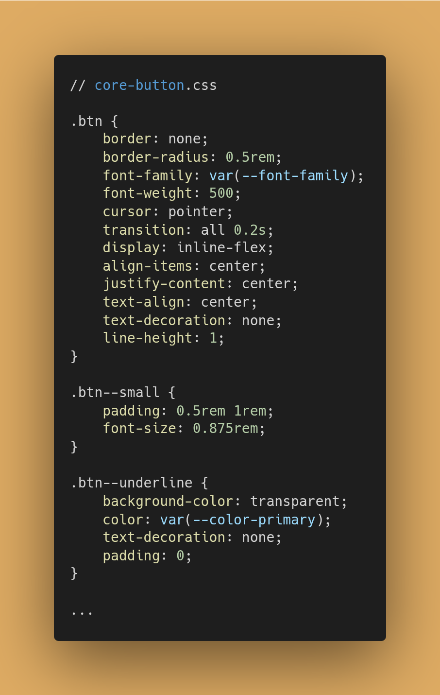

# Guia Técnico

Nessa seção, vou explicar como funciona o projeto.

## Backend

### Cache com Redis

Implementei um sistema de cache bem simples com Redis para a busca de usuário


Exemplo com findById.

Verifica o cache primeiro. Se não está no cache, busca no banco. Se achou, adiciona no cache.

As outras requisições são tratadas de forma parecida. O prazo de cache é de 5 minutos.

### JWT Guard e Strategy

No Nest, os guards são classes que implementam a função `canActivate`. Eles são responsáveis por verificar se o usuário tem permissão para acessar uma rota.


## Microfrontends

### Histórico de navegação com History Proxy

### Padronização de CSS

### Autenticação com JWT

### Interceptação de requisições

### Microfrontend de Autenticação

### Criação do env.d.ts

Criei arquivo env.d.ts em todos os microfrontends para evitar baixar o @types/node apenas para o process.env.
O @types/node é um pacote relativamente pesado que aumentaria o bundle. E também traria tipagens inconsistentes com o que funciona no browser.


## NPM Package

Para facilitar a visualização dos componentes, descobri algo chamado [Storybook](https://storybook.js.org/). Mas achei que precisaria de mais tempo para estudar pois nunca utilizei, então resolvi não utilizar e fiz uma documentação mais básica.

### Componentes do Design System

A implementação foi feita seguindo o padrão do Stencil para a criação de Web Components. Tentei fazer o mais simples possível e que fosse funcional. Claro que, em um projeto real, há muito o que melhorar e esses arquivos ficariam bem mais complexos.

A seguir, ilustrando o código do botão (implementação, testes e CSS) para exemplificar a implementação de um componente do Design System:

```bash
core-button/
├── core-button.tsx
├── core-button.css
└── core-button.spec.ts
```





### Export com Stencil para React

Utilizei o `@stencil/react-output-target` para transformar os Web Components produzidos pelo Stencil em Componentes React. O motivo está [aqui](./TROUBLESHOOTING.md#21---problema-de-compartilhamento-npm-package--stencil-com-microfrontends).

> O Stencil também possui bibliotecas oficiais para exportar no formato específico de cada framework (Angular, Vue, etc).

Ele armazena os Componentes React em formato TypeScript numa pasta `react/` na raiz do projeto.

Como o Webpack não conseguiu processar diretamente o código TypeScript, decidi compilá-lo para JavaScript e separar os arquivos de tipagem. Assim, os microfrontends importam o Javascript sem precisar de uma configuração no webpack especial (sem precisar transpilar TS de node_modules).


A vantagem é que os microfrontends importam o Javascript sem precisar de uma configuração no webpack especial (sem precisar transpilar TS de node_modules). Ou seja, simplifica o lado dos microfrontends.

Em resumo:

```bash
microhub-ui/
├── react/
│   ├── components.ts
│   └── index.ts
├── react-dist/
│   ├── components.d.ts
│   ├── components.js
│   ├── index.d.ts
│   └── index.js
├── ...
```

`react/`

- Código fonte dos proxies;
- Gerado automaticamente pelo Stencil;
- Contém import type, JSX, etc.

`react-dist/`

- Código compilado dos proxies;
- Pronto para consumo direto;
- JS + .d.ts separados.

Ou seja, nos microserviços de React funcionará como um React Component <CoreButton />, mas por baixo é um Web Component universal <core-button>, que funcionará em Vue, Angular, etc. É como um Adapter Pattern entre Web Components e React.


Uso dos componentes do NPM Package `microhub-ui`.
