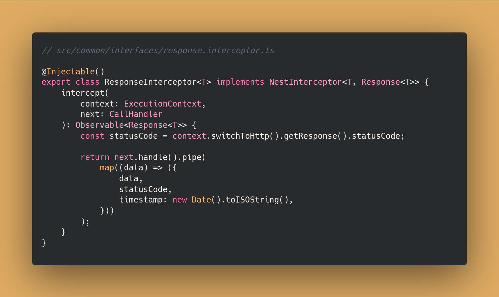
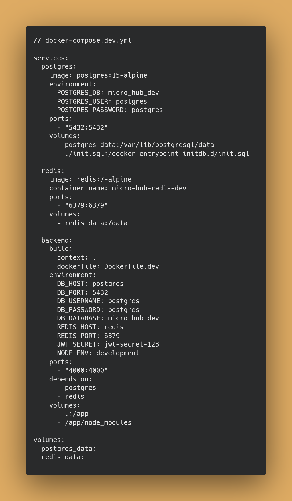

# Guia Técnico

Nessa seção, vou explicar em detalhe as partes técnicas do projeto.

### Linter

Todos os projetos possuem ESLint + Prettier para padronização de código.

## Backend

Como o Backend foi realizado com NestJS, a documentação técnica será um pouco voltada ao funcionamento do mesmo, visto que é um framework que abstrai muitas coisas.

Mais sobre a arquitetura do backend no [README de Arquitetura](./ARCHITECTURE.md).

### Main

No arquivo `main.ts`, é definido:

- Prefixo da aplicação (que será a partir de `/api`).
- Inicialização do Swagger;
- Portas permitidas;
- Execução do app.

Além disso, antes disso são definidos os seguintes middlewares:

#### 1. GlobalExceptionFilter

Responsável por capturar e tratar os erros globais.

#### 2. `ResponseInterceptor`

Responsável por interceptar as respostas e adicionar o timestamp e o status code.



#### 3. CORS

Para definir quais origens podem acessar a API.


#### GlobalExceptionFilter

Ver o arquivo completo a princípio parece complicado, mas é simples. Vou explicá-lo e por partes.

O `@Catch()` é um decorator que permite capturar exceções em um determinado escopo.

Se for um erro maior que 500, imprime no console. Em um projeto real, Winston, Pino, etc, poderiam ser utilizados para logar o erro e também utilizar algum serviço de monitoramento. E um sistema de agregação de logs, pensando em escalabilidade.

Se for outro tipo de erro, ele chama o método `buildErrorResponse`.

Para contruir a resposta, se for um erro HTTP, chama o método `handleHttpException`. Se não, se for um erro desconhecido, chama o método `handleUnknownException`.

Observe o `handleHttpException`:


Essa verificação se é string no `buildErrorResponse` é uma medida defensiva, pois existe a chance do NestJS retornar uma exception como string ou objeto:


Agora, observe o `handleUnknownException`:


Observe que nesse caso as respostas são pré-definidas, que é uma medida de segurança para evitar vazamento de informações sensíveis do sistema.

### Sistema de módulos

O sistema de módulos do NestJS é baseado no conceito de Injeção de Dependência e Inversão de Controle.


Ao definir os imports, eles são possíveis de serem injetados em outros módulos que estão definidos nesse arquivo.
Além disso, os providers podem ser injetados nos controllers e assim por diante.

### Autenticação

A autenticação foi feita com JWT.

No Nest, os guards são classes responsáveis por verificar se o usuário tem permissão para acessar uma rota. Eles utilizam os strategies para verificar se o usuário tem permissão para acessar uma rota. E se conectam através do 'jwt' definido no extend do JwtAuthGuard, o AuthGuard('jwt'). Com isso, o Nest busca uma classe strategy que começa com 'Jwt'.

E no Nest, é uma boa prática utilizar a biblioteca nativa `Passport` para autenticação, que utilizei.


Como o Nest abstrai bastante nessa parte, vou detalhar a ordem da execução do Guard com o Strategy.

Quando uma request chega:

1. Inicializa o `JwtAuthGuard` (ativa o constructor).<br> Disponibiliza o Reflector para a classe, que habilita verificar decorators.
2. `JwtAuthGuard`.canActivate(): <br>
   Verifica se é um request público (decorator @Public() nos controllers).<br>
   => Público: retorna true, pula autenticação.<br>
   => Não Público: chama super.canActivate() (que é a classe extendida, AuthGuard, do Passport).<br>
3. Inicializa `JwtStrategy` (ativa o constructor). <br> De acordo com os parâmetros do super, Passport verifica se o token é válido. Internamente extrai e valida o JWT.<br>
4. Se for válido: chama o `JwtStrategy`.validate(payload).<br>
   Busca o usuário com findById e verifica se ele já existe e não está inativo.<br>
5. Se existir, Passport manda para o user `JwtAuthGuard`.handleRequest() (e algum erro possível).<br>
   Lança um erro se vier um erro ou não tiver usuário.<br>
   Se vier um user, `JwtAuthGuard` injeta user no request. `request.user = user`<br>

O Controller consegue saber que o usuário está autenticado através do decorator @CurrentUser(), que retorna true se o `request.user` existir.


Além disso, todas as rotas são protegidas por padrão graças à configuração no `app.module.ts` com a seguinte configuração no providers:


Isso funciona porque:

- O `APP_GUARD` é um token especial do NestJS que faz com que o guard em que ele está seja aplicada a todas as rotas.
- O `JwtAuthGuard` é o guard que verifica se o usuário está autenticado.

E isso foi feito como medida de segurança. Caso um desenvolvedor queira desabilitar a proteção de alguma rota, ele terá que manualmente definir @Public() na rota.

### Entities

O TypeORM é um ORM que facilita a interação com o banco de dados.
Para integrá-lo ao projeto, preciso definir minhas entidades com seu auxilio.


O `@Exclude()` que é a abordagem padrão para esconder campos sensíveis. Remove automaticamente o campo da resposta JSON quando a entidade é retornada pelas APIs.

O atributo `isActive` é um booleano que serve para a implementação do padrão de soft delete, que implementei. Nele, os usuários são apenas marcados como inativos ao invés de serem deletados do banco de dados.

Assim, o histórico de dados críticos são preservados. Isso permite a reativação simples de usuários, oferece melhor performance (mais rapido UPDATE que DELETE) e permite rastros para investigações de segurança. Além de análises históricas sobre padrões de usuários, muito importante para a área de Análise de Dados.

A aplicação exige um CRUD básico. Mas, resolvi adicionar o atributo `role` e uma rota protegida para ficar um pouco mais próxima de uma aplicação real, embora eu não esteja utilizando-a no frontend. É uma rota de estatística simples, que conta a quantidade de usuários ativos.

### Cache com Redis

Implementei um sistema de cache bem simples com Redis para a busca de usuário


Exemplo com findById.

Verifica o cache primeiro. Se não está no cache, busca no banco. Se achou, adiciona no cache.

As outras requisições são tratadas de forma parecida. O prazo de cache é de 5 minutos.

### DTOs

DTOs são classes que representam e validam os dados que a API envia ou recebe.
Neste projeto, são utilizados para os dados recebidos nas requisições.


A validação dos dados é feita com Decorators. Isso foi feito porque diferentes rotas exigiam validações muito parecidas ou até iguais. Então, foi criado um decorator para cada tipo de validação.


Alguns até um pouco mais complexos, mas seguindo a mesma lógica:


Esse decorator de senha em específico deveria ser bem mais completo (validando presença de letras maiúsculas, números... etc), mas como o projeto é pequeno, decidi fazer apenas com o mínimo necessário.

Esse decorator eventualmente poderia precisar de algum parâmetro que definiria a força da senha. E, com base nele, a validação seria mais ou menos rigorosa em vários aspectos. Mas, como isso aumentaria a complexidade desnecessariamente (YAGNI), só valeria a pena quando realmente demandasse.

### Controllers

Os controllers são responsáveis por receber as requisições e retornar as respostas.

Exemplo da rota `PUT /users/:id`:


Como pode perceber, são muitos decorators. Mas vários deles são de documentação do Swagger (os que iniciam com `@Api`). É importante manter o Swagger próximo do código para lembrar o desenvolvedor de atualizá-lo quando hover alguma alteração.

Perceba que o userService é injetado no controller (pelo `users.module.ts`).

E essa rota não é pública, pois não possui o decorator `@Public()`.

### Services

Os services são responsáveis por executar a lógica do negócio, são chamados pelos controllers.


Observe que o userRepository é injetado pelo TypeORM, abstraindo a necessidade de criar manualmente a camada Model ou Repository para o acesso ao banco de dados.

### Health Check

Os arquivos `app.controller.ts` e `app.service.ts` implementam um health check para verificar se a aplicação está funcionando.

### Swagger

O projeto foi documentado com o Swagger (`@nestjs/swagger`). Difersos decorators foram utilizados para informar as propriedades das requisições (nos controllers) e validações (nos decorators de validação dos DTOs).


### Uso de constants

Foi criado um arquivo `error-messages.ts` por diversas razões:

- Facilitar na manutenção, tradução para outros idiomas, testes e debugging;
- Evitar duplicação de código, padronizar as mensagens.


Segue como foi utilizado:


### Docker

Para facilitar a execução do projeto e escalabilidade, foi criado um Dockerfile para o backend.

Segue o Dockerfile com explicações de cada linha:

Dockerfile de produção:


Dockerfile de desenvolvimento, mais simples:


Para facilitar a execução do projeto, foi criado um ambiente de desenvolvimento com Docker Compose. Ele sobe containers para o banco de dados, o Redis e o backend, conectando-os automaticamente. Assim, basta um único comando para iniciar todo o projeto, sem precisar instalar nada além do Docker.



Em produção, especialmente em projetos de grande escala, o foco principal está nos Dockerfiles. Isso porque cada serviço (backend, banco de dados e Redis) normalmente é executado em ambientes separados, sendo orquestrados por ferramentas como Kubernetes ou serviços de nuvem, em vez de um único Docker Compose.

## Microfrontends

### Tratamento de erros

O Error Boundary foi implementado com o uso do pacote 'react-error-boundary'. A ideia foi criar um componente que seja capaz de ser utilizado em qualquer contexto.

Acredito que o ideal seria ele estar em uma lib própria de utilitários de frontend (NPM Package) para ser reutilizado em outros projetos junto com outros utilitários.
No caso desse projeto, o código do Error Boundary é o mesmo no projeto `auth-microfrontend` e `rick-morty-microfrontend`.

Exemplo de uso básico:


É possível customizá-lo completamente. Segue um exemplo de como isso pode ser feito:


O resetKeys é uma propriedade do react-error-boundary que recebe um array de valores que, quando algum deles é alterado, reseta o erro.

A implementação do ErrorBoundary é bem simples e direta, segue o código real algumas explicações:


O errorLogger é um objeto que é responsável por capturar os erros e enviar para o console (em desenvolvimento) e, em produção, para algum outro serviço de monitoramento (como Sentry, LogRocket, etc). Não cheguei a implementar essa integração, mas a forma de integrar isso é bem simples:


O ErrorBoundary também recebe um fallbackComponent por padrão, que é um componente que criei que segue uma estrutura parecida com o do DataErrorFallback da penúltima imagem.

A visualização do ErrorFallback padrão desse projeto é a seguinte:


Os detalhes técnicos aparecem somente para desenvolvedores e mostram o erro e o stack trace para debug.

Mas, apenas envolver o componente principal com ErrorBoundary não é suficiente para capturar erros assíncronos.
Por isso, foi necessário criar um hook para capturar os erros assíncronos. Segue o código com um exemplo de uso:


Como pode ser visto, o`react-error-boundary` já possui um hook para invocar o ErrorBoundary. Então a implementação é bem simples.

Essa propriedade `shouldShowInBoundary` é uma propriedade que é acoplada ao error (como um decorator) no interceptor do axios (que é usado para as requisições). Nele, defini que erros com status >= 500, o erro é mostrado via ErrorBoundary. Pois como são erros do servidor, o usuário não pode fazer nada para resolver. Os demais, são tratados inline.

Caso seja um formulário, o hook criado `useForm` chama o `handleApiError` internamente para capturar os erros caso passe pelas verificações de validação definidas.


Dessa forma, os erros são lidados de forma consistente em qualquer contexto.

### Formuláros

Para envio de formulários, eu considerei utilizar o Formik ou outro framework bem estabelecido, mas, como comentado acima, optei por implementar um hook `useForm` para evitar tantas dependências.

Nele, é possível passar uma função de validação e uma função de submit.


As funções de validação são simples e estão armazenadas no arquivo `validation.ts`.

### AuthApp e conexão com o backend

Para armazenar o token e o usuário, foi utilizado o localstorage.

Sobre o uso de localstorage está no [README de Resolução de Problemas](./TROUBLESHOOTING.md#11---compartilhamento-de-estadosautenticação-entre-microfrontends).

Como não é a solução ideal e deve ser substituída, não irei me estender sobre ela neste documento.

No `AuthApp`, a conexão com o backend é feita diretamente via Axios. Para aprimorar essa comunicação, poderia ser implementado um sistema de retry com exponential backoff (estratégia em que o tempo de espera entre cada tentativa aumenta de forma exponencial) e jitter (variação aleatória nesse tempo de espera para evitar sobrecarga simultânea).
Outra alternativa seria utilizar o `SWR`, que já oferece essas soluções nativamente e ainda possibilita adicionar cache no client side, o que não foi implementado neste App pois não faria tanto sentido por ser um microfrontend de autenticação.

Já no `RickMortyApp`, a conexão com o backend é feita através do `SWR`, que já oferece essas soluções nativamente e ainda possibilita adicionar cache no client side.

### Rota Protegida

Rotas que necessitam de autenticação são encapsuladas em um componente `ProtectedRoute` que verifica se o usuário está autenticado e redireciona para a página de login se não estiver.


Além disso, esse ProtectedRoute é capaz também de receber um parâmetro para identficar se o usuário possui determinado cargo (no backend, existe um campo `role` com possibilidade de ser `admin`, apesar de eu não ter utilizado isso no frontend).


### Interceptação de requisições

### Microfrontend de Autenticação

### Importação em lote e Aliases de Caminho (Barrel Export e Path Aliases)

Em todos os projetos, a técnica do Path Alias foi utilizada para importar arquivos de forma mais fácil e organizada.
Que é a importação dos arquivos através de `@/` em vez de `../`, `../../`.

E a estratégia do Barrel Export para auxiliar nessa importação.
Que é a criação de arquivos `index.ts` em cada pasta que exportam todos os arquivos da pasta.

### Exportação de assets

A fim de facilitar a importação de assets, foi criado um arquivo `index.ts` em cada pasta de assets que exporta todos os assets da pasta.

```bash
assets/
├── icons/
│   ├── alert.tsx
│   ├── person.tsx
│   ├── index.tsx
│   ...
```


Foi realizado dessa forma para que seja possível importar os Assets como React Components e alterar sua estilização de forma mais fácil. Além disso, todos com o nome `Icon` facilita em manutenção, escalabilidade e evitar conflitos de nomes dos ícones.

Exemplo de uso dos ícones:


### Criação do env.d.ts

Foi criado um arquivo env.d.ts em todos os microfrontends para evitar baixar o @types/node apenas para o process.env (que foi necessário para o arquivo `bootstrap.ts`).
O @types/node é um pacote relativamente pesado que aumentaria o bundle. E também traria tipagens inconsistentes com o que de fato funciona no browser.


## NPM Package

Para facilitar a visualização dos componentes, descobri algo chamado [Storybook](https://storybook.js.org/). Mas achei que precisaria de mais tempo para estudar pois nunca utilizei, então resolvi não utilizar e fiz uma documentação mais básica.

### Componentes do Design System

A implementação foi feita seguindo o padrão do Stencil para a criação de Web Components. Tentei fazer o mais simples possível e que fosse funcional. Claro que, em um projeto real, há muito o que melhorar e esses arquivos ficariam bem mais complexos.

A seguir, ilustrando o código do botão (implementação, testes e CSS) para exemplificar a implementação de um componente do Design System:

```bash
core-button/
├── core-button.tsx
├── core-button.css
└── core-button.spec.ts
```


### Export com Stencil para React

Utilizei o `@stencil/react-output-target` para transformar os Web Components produzidos pelo Stencil em Componentes React. O motivo está [aqui](./TROUBLESHOOTING.md#21---problema-de-compartilhamento-npm-package--stencil-com-microfrontends).

> O Stencil também possui bibliotecas oficiais para exportar no formato específico de cada framework (Angular, Vue, etc).

Ele armazena os Componentes React em formato TypeScript numa pasta `react/` na raiz do projeto.

Como o Webpack não conseguiu processar diretamente o código TypeScript, decidi compilá-lo para JavaScript e separar os arquivos de tipagem. Assim, os microfrontends importam o Javascript sem precisar de uma configuração no webpack especial (sem precisar transpilar TS de node_modules).


A vantagem é que os microfrontends importam o Javascript sem precisar de uma configuração no webpack especial (sem precisar transpilar TS de node_modules). Ou seja, simplifica o lado dos microfrontends.

Em resumo:

```bash
microhub-ui/
├── react/
│   ├── components.ts
│   └── index.ts
├── react-dist/
│   ├── components.d.ts
│   ├── components.js
│   ├── index.d.ts
│   └── index.js
├── ...
```

`react/`

- Código fonte dos proxies;
- Gerado automaticamente pelo Stencil;
- Contém import type, JSX, etc.

`react-dist/`

- Código compilado dos proxies;
- Pronto para consumo direto;
- JS + .d.ts separados.

Ou seja, nos microserviços de React funcionará como um React Component <CoreButton />, mas por baixo é um Web Component universal <core-button>, que funcionará em Vue, Angular, etc. É como um Adapter Pattern entre Web Components e React.


Uso dos componentes do NPM Package `microhub-ui`.

### Tipografia

Para utilizar os Web Components, é necessário importar o CSS do Stencil, a segunda linha da imagem abaixo.


Eu não estava satisfeito com precisar definir para qualquer tag HTML a fonte, cor e o tamanho da fonte e ainda me preocupar em padronizar entre todos os microfrontends. Então, resolvi definir no CSS da lib que eu já havia criado.


Importante ressaltar que essas estilizações vindas do NPM Package podem e devem ser sobrescritas de acordo com as situações, elas são apenas um ponto de partida para a padronização do sistema.

Veja um exemplo de uso em que já há estilizações padrão, mas algumas classes foram sobrescritas (como cor e tamanho no parágrafo):


Em um cenário real, eu provavelmente implementaria uma forma de importar apenas partes específicas da UI do NPM Package, mas para esse projeto foi suficiente.
