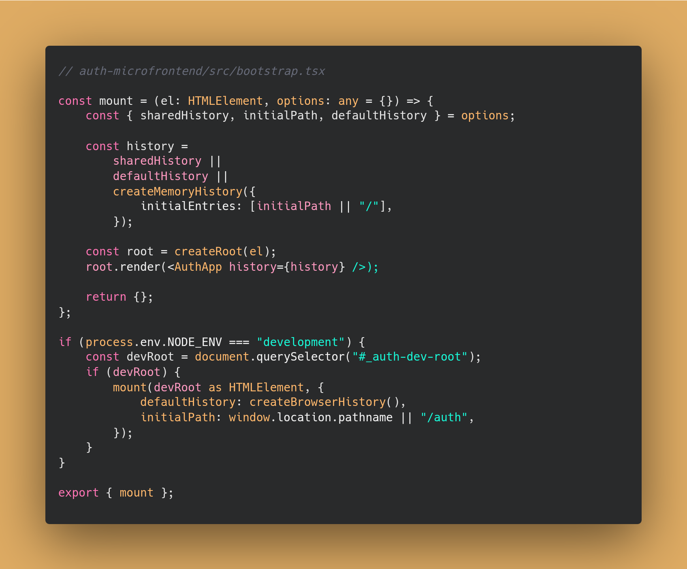

# Problemas principais do projeto

## 1 - Problema de roteamento e histórico entre Microfrontends

No começo, segui a abordagem de um curso de microfrontends que havia comprado para estudar. Essa solução utilizava callbacks para sincronizar a navegação. Mas, na prática, percebi que ela não funcionava tão bem: às vezes o botão de voltar/avançar do navegador não respondia corretamente, e em outras a URL não era atualizada como deveria. Criava ciclos de navegação e entradas duplicadas no histórico.

Mas o curso me fez entender que utilizar uma função de mount seria uma excelente ideia.

Após testar diferentes alternativas, acredito que cheguei a uma boa solução. É um pouco complexa, mas com uso de muitos console.logs consegui fazê-la funcionar.

A solução se baseia no fato de que preciso que todos os microfrontends utilizem o mesmo history.

O container principal é o `microhub-shell`. Nele, é definido que sempre que acessar o AuthApp, ele adicionará ao seu history '/auth'.


Todos os microfrontends (incluindo o AuthApp) possuem uma função mount que está disponível para ser importada. <br> Ela é passada para dentro do MicrofrontendWrapper:


O MicrofrontendWrapper cria um objeto 'history' manualmente, que será exportado para os microfrontends.

> Isso é necessário porque o React Router v6 removeu sua exposição. E nós precisamos adicionar uma função listener nele.

Adicionei explicações dentro da foto sobre o MicrofrontendWrapper:


Ou seja, o container principal avisa os microfrontends em caso de mudança com o listen().

E caso os microfrontends mudem, eles avisam o container principal com o simples fato de utilizar o history. Isso só é possível por um benefício do Module Federation de compartilhar dependências entre microfrontends:


Esse 'singleton: true' permite isso.

Como explicado, os microfrontends são renderizados com a execução de uma função mount, que contém o sharedHistory principal.<br><br>
Logo, no arquivo inicial de cada microfrontend (`bootstrap.tsx`) é exportada essa função, que será executada pelo container principal.


Perceba que sua única função é passar o histórico compartilhado e criar o root do microfrontend.

Essa versão acima é a simplificada. <br> <br>Abaixo está a versão final, que inclui a opção de executar o microfrontend isoladamente (para desenvolvimento). Ou seja, o histórico compartilhado não é passado, 'sharedHistory = undefined'. Nesse caso, utiliza-se o defaultHistory, que é o próprio browser history do navegador.



O createMemoryHistory do arquivo acima é um fallback de segurança caso o browserHistory falhe, e também para funcionar no ambiente de testes ou outros ambientes não browser. O createBrowserHistory() não funciona no servidor, então microfrontends com SSR também utilizariam o createMemoryHistory.

Agora, vamos ver como nós recebemos as atualizações do sharedHistory, que agora virou history:


Quando executamos o microfrontend via container principal, o "update.location" é o location do container principal (e o history.location também).

Mas se utilizarmos o history.location, causará um bug de sincronização, não atualizará a tela para o container principal. O update.location possui dados "frescos" do evento.

Caso o desenvolvedor inicie o microfrontend isoladamente, o update.location virá como undefined, aí será necessário utilizar o history.location. Mas nesse caso não tem problema, pois não há nada para sincronizar.

Essa solução é eficiente porque não faz re-mount, ela reutiliza o Router principal. E ainda é capaz de lidar com a execução individual dos microfrontends (para cada equipe de desenvolvimento).

Tentei abstrair ao máximo a complexidade para que seja o mais fácil de escalar possível.

No container principal (`microhub-shell`), basta adicionar dessa forma:


```bash
microhub-shell/
├── microfrontends/
│   ├── MicrofrontendWrapper.tsx
│   ├── AuthApp.tsx
│   └── RickMortyApp.tsx
├── ...
```

Com essa solução, nenhuma equipe de desenvolvimento precisa se preocupar com o history, ele é gerenciada pelo container principal. Basta copiar a função de mount do arquivo 'bootstrap.tsx' (que é padrão para todos os microfrontends) e chamar ela no seu arquivo inicial. E adicionar no container principal esse modelo da foto acima.

## 1.1 - Compartilhamento de estados/autenticação entre microfrontends

Atualmente o projeto utiliza a comunicação à respeito da autenticação através das props dessa forma:


Depois, defini no container principal um estado global para controlar a autenticação, e salvei no localStorage.

Isso serviria para qualquer tipo de estado, funcionando como um Redux, por exemplo.

Para um projeto real, essa solução seria ruim pois cada microfrontend deve ser independente. Com essa solução o container principal precisaria conhecer todos os microfrontends. A cada mudança de estado de um time, precisaria modificar o container principal.

E compartilhar estados ou autenticação via localstorage/sessionstorage (como foi feito) seria um risco grave de vulnerabilidade (em especial, XSS).

A forma de compartilhar estados via aplicações que acredito ser ideal envolveria conexão com o backend e SameSite cookies HTTPOnly e com tokens CSRF. Não tive tempo de implementá-la.

## 2 - Padronização do CSS entre Microfrontends

Logo percebi que teria que resolver o problema de conflitos e padronização de CSS.
De primeiro momento pensei em definir no microfrontend principal `microhub-shell` os arquivos .css e tailwind.config.js configurados, já que todos inciariam dele.<br><br>
Mas, quando comecei a pensar em escalabilidade, logo pensei em alguns problemas. Para começar eu obrigaria todos os microfrontends à terem como base essas configurações, o que faria com que eles fossem menos independentes. O ideal é que cada microfrontend escolhesse se quer utilizar a estilização base ou não, e qual parte dela.<br>
Além disso, em ambiente de desenvolvimento, eu seria obrigado a executar os microfrontends a partir do `microhub-shell` para ter acesso aos estilos. Isso reduziria bastante a independência de cada microfrontend.

A forma de resolver isso foi adicionando a estilização base no NPM Package `microhub-ui` que eu já havia criado para lidar com componentes reutilizáveis. E permitir que cada microfrontend escolhesse se quer utilizar a estilização base ou não, e qual parte dela.


Nesse caso acima, o microfrontend AuthApp possui estilizações próprias no `index.css`, mas utiliza a estilização base do `microhub-ui` para os componentes.

Vale ressaltar que, caso o microfrontend desejasse sobrescrever alguma regra do `microhub-ui`, ele poderia fazer isso simplesmente alternando a ordem em que são chamados no arquivo inicial.

Além disso, classes Tailwind específicas dentro dos componentes sobrescrevem as classes do `microhub-ui`.

### 2.1 Componentes Reutilizáveis Cross-Framework? Web Components!

Primeiro eu defini que gostaria de um sistema que seja capaz de lidar com qualquer framework: React, Angular, Vue… etc para ser o mais independente possível. Pois estava pensando em um App de grande escala, eu não poderia ficar preso à frameworks.

Mas eu havia feito minha biblioteca com React Components, e eu só percebi que isso forçaria meus microfrontends ao React depois que já havia feito `(curiosidade: é a versão 1.x.x da microhub-ui, por isso atualmente ela é 2.x.x)`. Então, tive que refazê-la completamente.

Ao pesquisar soluções possíveis, inicialmente pensei em utilizar a técnica de Tokens + CSS. Mas, eventualmente percebi que não seria uma solução boa. Primeiro porque não teria as lógicas internas dos componentes implementadas, apenas o CSS. Além disso, não teria isolamento, poderia vazar CSS.

Então encontrei uma solução melhor: Web Components.
Segue um exemplo à respeito das vantagens do Web Components em comparação com o Tokens + CSS à respeito de encapsulamento de CSS:


### 2.2 - Problema de compartilhamento NPM Package + Stencil com Microfrontends

Inicialmente consegui renderizar um `<core-button> </core-button>`, mas o problema de tipagem não conseguia resolver.

Após pesquisar, descobri que uma forma possível seria utilizar um framework para transformar os Web Components em React Components.

Vantagens:

- Melhor DX (Developer Experience) para desenvolvedores React, API de eventos/props mais integrada ao framework:

  O wrapper pode converter atributos e eventos customizados dos Web Components para a forma idiomática do React, garantindo uso consistente como qualquer outro componente React. Evita maior curva de aprendizado para os times de desenvolvimento de cada microfrontend com a lib universal.

- Maior compatibilidade com SSR:

  Qualquer SSR consegue renderizar Web Components como tags estáticas. Mas sem o wrapper, podemos ter problemas com conteúdo vazio até o JS carregar ou até erro de Hydration mismatch.

- Tipagem completa: TypeScript + IntelliSense;

- Bundle otimizado: Componentes carregam sob demanda.

A solução final está no arquivo [TECHNICAL-GUIDE.md](./TECHNICAL-GUIDE.md#componentes-do-design-system).
